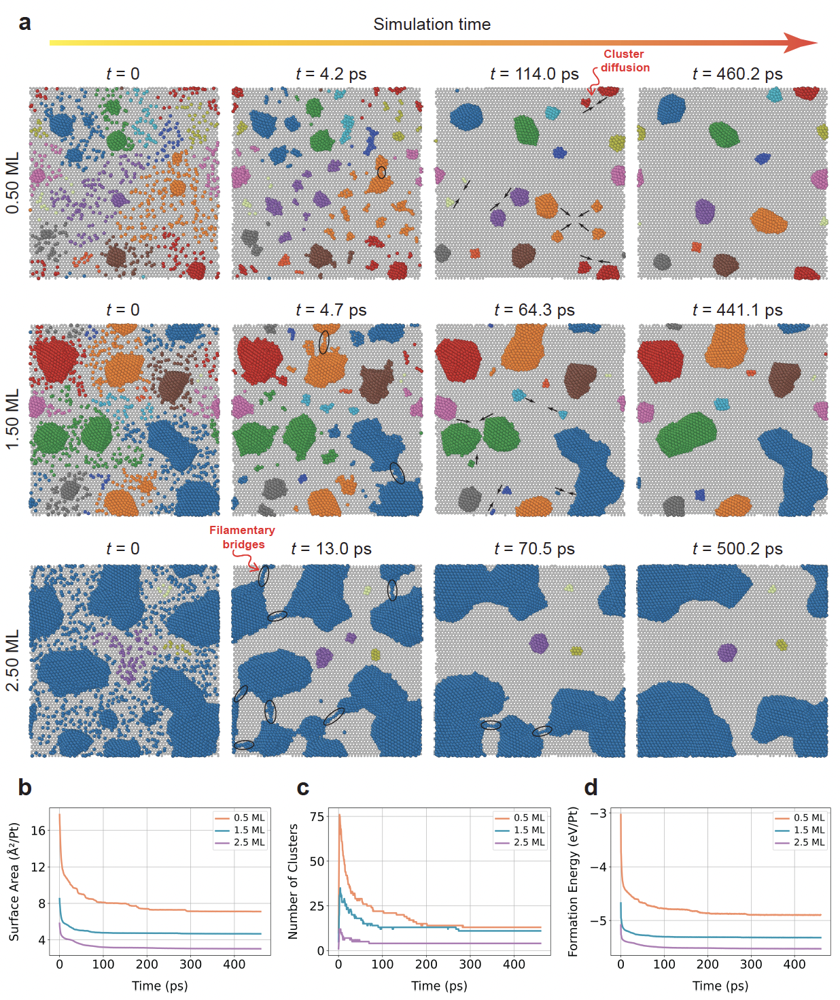

# MLIP-GrPt_CrystGrow-H2_Sensing

> **Platinum-functionalized graphene** combines ultra-high carrier mobility with Pt’s catalytic activity for chemiresistive H₂ detection, but connecting synthesis, morphology, and sensor metrics at the atomistic level is challenging. We trained an equivariant neural network potential with near-DFT accuracy to run large-scale MD simulations of Pt PVD crystal growth on graphene and subsequent H₂ sensing, establishing a predictive pipeline from deposition conditions through nanocluster structure to chemiresistive performance.

## Overview
This repository provides:
- **Equivariant NNP workflows** for training and deploying machine-learned interatomic potentials.  
- **MD pipelines** for Pt physical-vapor-deposition (PVD) crystal growth on graphene.  
- **H₂-sensing simulations** on Pt/graphene devices.  
- Tools to compute key figures of merit:
  - **Response time** & **Recovery time**  
  - **Limit of detection** 
  - **Transduction sensitivity**  

## Web Demos
### Interactive, browser-based video visualizations (no software install required — Just click below):

  

Use the tabs at the top of the page to switch between:
- ⚛️ Crystal Growth (Pt deposition movies)  
- 📶 H₂ Sensing (H₂ sensing movies)

## Paper
**Data-Driven Molecular Dynamics and TEM Analysis of Crystal Growth and Hydrogen Sensing in Platinum-Functionalized Graphene Chemiresistive Sensors**  
arXiv: [2504.05438](https://arxiv.org/abs/2504.05438)  
